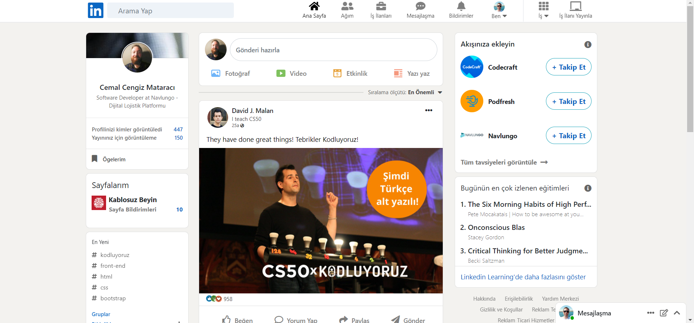
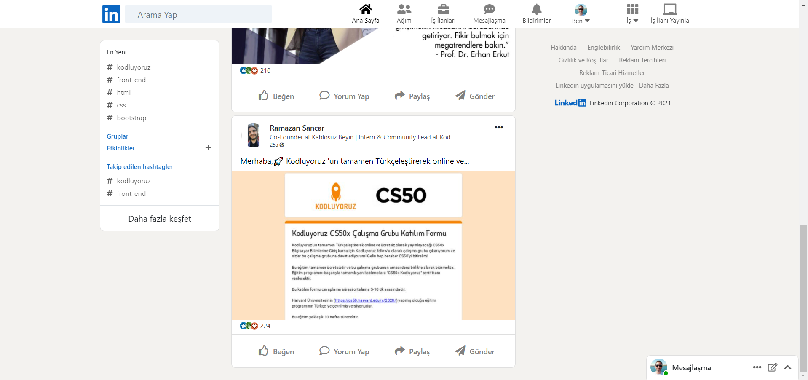

# Kodluyoruz - Bootstrap Ödev 3
## Linkedin clone tasarımı 
Tasarım Görseli;





## About Project
Bu repo, [Kodluyoruz](https://kodluyoruz.org) Front-End Eğitiminde oluşturduğum üçüncü bootstrap ödevim.

Projemde linkler, sticky ve fixed elemanlar ( navbar, right panel, footer vs ) çalışıyor.

## Installation
Projeyi klonlayarak kullanabilirsiniz. 
```
https://github.com/aybarsumur/linkedin-clone-bootstrap.git
```